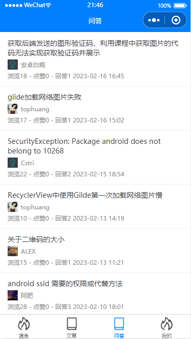

# SunOfBeach 阳光沙滩 小程序版
--------
- 基于uniapp开发的SunOfBeach（阳光沙滩）小程序版
- 数据来源程序员**拉大锯**开发的阳光沙滩网站提供的api
[网站首页：](https://www.sunofbeach.net) 

## 使用
--------
- 直接下载使用或者使用Git： `git clone git@github.com:asanlu/SunOfBeach.git`
- 修改`manifest.json`中微信小程序中的appid
```
"mp-weixin" : {
    "appid" : "xxxxx",
    "setting" : {
        "urlCheck" : false
    },
    "usingComponents" : true,
    "lazyCodeLoading": "requiredComponents"
},
```
- 在HBuilder中运行到小程序模拟器
- 主要使用库`uni-ui`和`vuex`
- [富文本解析mp-html](https://ext.dcloud.net.cn/plugin?id=805) 

----------
## 预览图

- 摸鱼

- 文章

- 问答


- 登录

- ......
  
---------
## 2